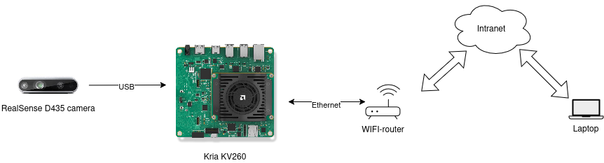
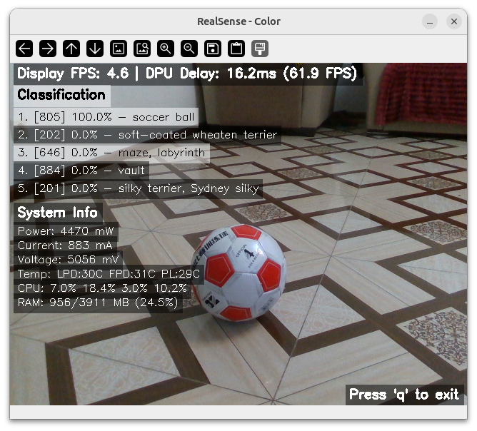

# Kria Camera Demo & DPU Benchmark

Real-time object classification demo and DPU performance benchmarking suite for the AMD Xilinx Kria KV260 Vision AI Starter Kit, combining Intel RealSense camera integration with Vitis AI inference and layer-by-layer profiling via vaitrace.

## Platform Setup

The system connects a **RealSense D435 camera** to the **Kria KV260** board via USB, with the board accessible over Ethernet through a WiFi router from a development laptop.



## Features

### Camera Demo
- **Real-time Object Classification** — MobileNet V2 inference on live RealSense camera feed
- **Dual FPS Monitoring** — Overall frame rate and DPU inference speed
- **System Monitoring** — Power, temperature, CPU utilization, and memory usage
- **Top-5 Predictions** — Classification results with confidence scores
- **Depth Visualization** — Color-mapped depth stream (640×480 @ 30fps)

### DPU Benchmark
- **Synthetic Testing** — Uses random images, no camera required
- **Vaitrace Instrumentation** — Layer-by-layer DPU profiling
- **Comprehensive Statistics** — Mean, std, min, max, P50, P95, P99
- **Reproducible Results** — Fixed random seed support
- **Warmup Phase** — Ensures accurate steady-state measurements

### Trace Analyzer
- **Automatic Analysis** — Runs automatically after `run_vaitrace.sh` completes
- **Per-Layer Stats** — Mean latency, std dev, CoV(%), min/max, efficiency (GOP/s)
- **Timeline Order** — Layers sorted by execution order in the model
- **CSV Export** — Save results with `--csv-out`

## Requirements

### Hardware

| Component | Details |
|-----------|---------|
| AMD Xilinx Kria KV260 | Vision AI Starter Kit |
| Intel RealSense D435 | Connected via USB 3.0 (camera demo only) |
| Network | Ethernet/WiFi for remote deployment |

### Software

- PYNQ framework with DPU support
- Python 3.10
- DPU bitstream (`dpu.bit`)
- Vitis AI runtime

## Quick Start

### 1. Deploy to Kria

```bash
rsync -avz --exclude=venv --exclude=.git --exclude=__pycache__ ./ ubuntu@192.168.100.8:~/kria-camera-demo/
```

### 2. Run DPU Benchmark with Profiling

```bash
# Apply vaitrace bug fix (first time only)
ssh ubuntu@192.168.100.8 "cd ~/kria-camera-demo && ./patch_vaitrace.sh"

# Run profiling (500 frames)
ssh ubuntu@192.168.100.8 "cd ~/kria-camera-demo && ./run_vaitrace.sh -n 500"

# Download profiling results
scp ubuntu@192.168.100.8:~/kria-camera-demo/*.csv ./
```

### 3. Run Camera Demo

```bash
ssh ubuntu@192.168.100.8 "cd ~/kria-camera-demo && sudo /usr/local/share/pynq-venv/bin/python3 kria-camera-demo.py"
```

## Installation

### On Your Development Machine

```bash
git clone <repository-url>
cd kria-camera-demo
```

Model files are not included in the repo. See [Downloading Models](#downloading-models) below.

### On the Kria Board

1. Activate the PYNQ environment:
   ```bash
   source /usr/local/share/pynq-venv/bin/activate
   ```

2. Install dependencies:
   ```bash
   pip3 install -r requirements.txt
   ```

3. Verify the DPU bitstream is present:
   ```bash
   ls dpu.bit
   ```

4. Download model files and place them in `models/` (see [Downloading Models](#downloading-models)).

## Downloading Models

Model files (`.xmodel`) are **not included** in this repository due to their size. Download them from the [Vitis AI Model Zoo](https://github.com/Xilinx/Vitis-AI/tree/master/model_zoo).

### Supported Models

| Model | Input Size | Target DPU |
|-------|-----------|------------|
| `mobilenet_v2` | 224×224 | DPUCZDX8G_ISA1_B4096 |
| `mobilenet_v1_1_0_224_tf` | 224×224 | DPUCZDX8G_ISA1_B4096 |
| `resnet50` | 224×224 | DPUCZDX8G_ISA1_B4096 |

Download pre-compiled `.xmodel` files for target `DPUCZDX8G_ISA1_B4096` from:

```
https://github.com/Xilinx/Vitis-AI/tree/master/model_zoo/model-list
```

### Directory Structure

Place downloaded files as follows:

```
models/
└── your_model/
    ├── meta.json                  # Model metadata
    ├── your_model.xmodel          # Compiled DPU model
    └── your_model.prototxt        # Preprocessing parameters
```

**meta.json format:**
```json
{
    "lib": "libvart-dpu-runner.so",
    "filename": "your_model.xmodel",
    "kernel": ["subgraph_name"],
    "target": "DPUCZDX8G_ISA1_B4096"
}
```

**prototxt format:**
```
transform_param {
  mean_value: 104.0
  mean_value: 117.0
  mean_value: 123.0
  scale: 0.00392157
  scale: 0.00392157
  scale: 0.00392157
}
```

> **Note:** The `kernel` name in `meta.json` must match the subgraph name in the `.xmodel` file. Inspect the model with `xir subgraph <model>.xmodel` on the Kria board.

### Verify Download Integrity

```bash
cd models/mobilenet_v2
md5sum -c md5sum.txt
```

## Usage

### DPU Benchmark

The synthetic benchmark is the recommended way to profile DPU performance — no camera needed.

```bash
# With vaitrace profiling (recommended)
./run_vaitrace.sh -n 500

# Direct execution (no profiling)
sudo /usr/local/share/pynq-venv/bin/python3 utils/benchmark_dpu.py -n 500
```

| Option | Description | Default |
|--------|-------------|---------|
| `-n, --num-frames N` | Number of frames to process | 100 |
| `--warmup N` | Warmup iterations | 10 |
| `--seed N` | Random seed for reproducibility | 42 |
| `-m, --model-dir PATH` | Model directory | `models/mobilenet_v2` |
| `-b, --dpu-bit PATH` | DPU bitstream file | `dpu.bit` |
| `-l, --labels PATH` | Class labels file | `words.txt` |

### Camera Demo

Real-time camera application with live visualization. The interface shows the classified object, top-5 predictions with confidence scores, DPU inference FPS, and system stats (power, temperature, CPU, memory).



```bash
# Normal mode with GUI
sudo /usr/local/share/pynq-venv/bin/python3 kria-camera-demo.py

# Headless mode for profiling
./run_vaitrace.sh kria-camera-demo.py

# Custom model
sudo /usr/local/share/pynq-venv/bin/python3 kria-camera-demo.py -m models/resnet50
```

| Option | Description | Default |
|--------|-------------|---------|
| `-m, --model-dir PATH` | Model directory | `models/mobilenet_v2` |
| `-b, --dpu-bit PATH` | DPU bitstream | `dpu.bit` |
| `-l, --labels PATH` | Class labels | `words.txt` |
| `--headless` | Run without GUI (for profiling) | — |
| `--profile-frames N` | Frames in headless mode | 100 |

Press `q` to quit the GUI.

## Profiling with Vaitrace

Vaitrace provides layer-by-layer DPU profiling with minimal overhead.

```bash
# 1. Apply vaitrace patch (fixes a KeyError bug — run once)
./patch_vaitrace.sh

# 2. Run profiling
./run_vaitrace.sh -n 500

# 3. Check generated output files
ls -lh *.csv
```

**Output files:**

| File | Contents |
|------|----------|
| `vart_trace.csv` | Layer-by-layer execution trace with timestamps |
| `vitis_ai_profile.csv` | Detailed DPU profiling and utilization metrics |
| `profile_summary.csv` | Aggregated performance summary |

`run_vaitrace.sh` automatically parses `vart_trace.csv` via `utils/analyze_trace.py` and prints per-layer latency and efficiency statistics when profiling finishes. To save those results:

```bash
python3 utils/analyze_trace.py --csv-out layer_stats.csv
```

### DDR Traffic Analysis

`utils/plot_ddr_traffic.py` visualizes DDR memory bandwidth from profiling results. See `doc/mem_io_metric.md` for an explanation of the `Mem IO(MB)` and `Mem Bandwidth(MB/s)` columns in `profile_summary.csv`.

### Vaitrace Configuration

`run_vaitrace.sh` uses `--fine_grained` for detailed layer profiling and `--va` for VART runtime tracing, with automatic PYTHONPATH setup for PYNQ packages.

## Performance

### Expected Results (MobileNet V2)

| Stage | Latency | Throughput |
|-------|---------|------------|
| DPU Inference | ~6ms | 160+ FPS |
| Full Pipeline (camera + pre/postprocessing) | — | 25–35 FPS |
| Preprocessing | ~1–2ms | — |
| Postprocessing | <1ms | — |

### Tips for Accurate Measurements

1. Use the synthetic benchmark to isolate DPU performance from camera I/O
2. Use at least 500 frames for stable statistics
3. Always apply the vaitrace patch before profiling
4. Check P95/P99 latencies for worst-case analysis

## Project Structure

```
kria-camera-demo/
├── kria-camera-demo.py               # Real-time camera demo
├── run_vaitrace.sh                   # Vaitrace profiling wrapper ⭐
├── patch_vaitrace.sh                 # Fix vaitrace KeyError bug ⭐
├── utils/
│   ├── benchmark_dpu.py              # Synthetic DPU benchmark ⭐
│   ├── analyze_trace.py              # Per-layer trace analysis ⭐
│   ├── plot_ddr_traffic.py           # DDR bandwidth visualization
│   └── sync_timestamps.py            # Timestamp synchronization utility
├── camera_demo/
│   ├── kria_camera_demo.py           # Main camera demo class
│   ├── utils.py                      # Utilities
│   ├── preprocessing.py              # Image preprocessing
│   ├── visualization.py              # Display helpers
│   └── platform_monitor.py           # System monitoring
├── models/                           # Model directories (download separately)
│   ├── mobilenet_v2/
│   ├── mobilenet_v1_1_0_224_tf/
│   └── resnet50/
├── doc/
│   ├── platform_setup.png            # Hardware setup diagram
│   ├── mem_io_metric.md              # DDR memory metric explanations
│   └── ddrc_port_assignments.md      # DDR controller port reference
├── words.txt                         # ImageNet labels (1000 classes)
├── dpu.bit                           # DPU overlay bitstream
└── requirements.txt                  # Python dependencies
```

⭐ = Essential for DPU profiling

## Troubleshooting

### Vaitrace KeyError

**Symptom:** `KeyError: '_fun_XXXXXX'`

**Solution:** Run `./patch_vaitrace.sh`. This patches `/usr/bin/xlnx/vaitrace/tracer/function.py` to handle missing function symbols gracefully.

---

### DPU Memory Error

**Symptom:** `Check failed: fromdata != ((void *) -1)`

**Solution:** Don't use `XLNX_ENABLE_DUMP=1`. Use vaitrace instead.

---

### Camera Not Detected

**Solution:** Ensure the RealSense camera is connected via USB 3.0. Test with `realsense-viewer`.

---

### Permission Denied

**Solution:** Run with `sudo` — required for DPU hardware access.

---

### Module Not Found

**Solution:** Activate the PYNQ environment first:
```bash
source /usr/local/share/pynq-venv/bin/activate
# or use the full Python path:
/usr/local/share/pynq-venv/bin/python3
```

---

### Wrong Kernel Name in meta.json

**Symptom:** DPU runner fails to initialize or returns no results.

**Solution:** Inspect the xmodel to find the correct subgraph name, then update `kernel` in `meta.json`:
```bash
xir subgraph models/your_model/your_model.xmodel
```

## Network Configuration

Default Kria IP: `192.168.100.8`

Update in `CLAUDE.md` if your board uses a different address.

## Contributing

When adding a new model:
1. Download the compiled `.xmodel` for target `DPUCZDX8G_ISA1_B4096`
2. Create a directory under `models/` with the proper structure
3. Add `meta.json`, `.prototxt`, and `md5sum.txt`
4. Test with the benchmark: `./run_vaitrace.sh -m models/new_model -n 100`

## Funding

[](https://daiedge.eu/)
[](https://research-and-innovation.ec.europa.eu/funding/funding-opportunities/funding-programmes-and-open-calls/horizon-europe_en)

This work was supported by the **[dAIEDGE Open Call Programme](https://daiedge.eu/)**, funded by the **[European Union's Horizon Europe research and innovation programme](https://research-and-innovation.ec.europa.eu/funding/funding-opportunities/funding-programmes-and-open-calls/horizon-europe_en)**.

## License

This project is licensed under the [Apache License 2.0](LICENSE).

You may use, reproduce, and distribute this work under the terms of the Apache License, Version 2.0. See the [LICENSE](LICENSE) file for the full text.

## References

- [AMD Xilinx Kria KV260](https://www.xilinx.com/products/som/kria/kv260-vision-starter-kit.html)
- [Vitis AI Model Zoo](https://github.com/Xilinx/Vitis-AI/tree/master/model_zoo)
- [Intel RealSense](https://www.intelrealsense.com/)
- [Vitis AI](https://www.xilinx.com/products/design-tools/vitis/vitis-ai.html)
- [PYNQ](http://www.pynq.io/)
